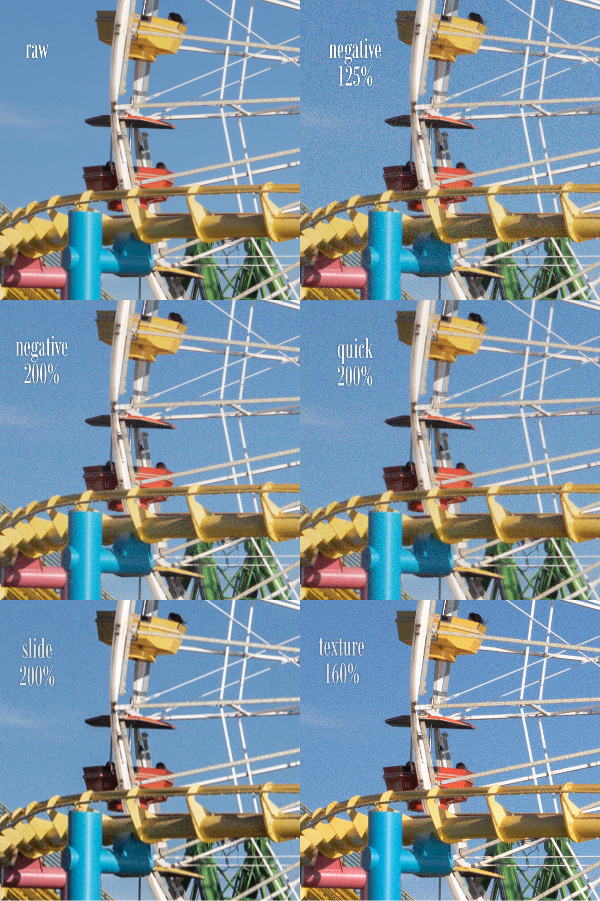

# Photoshop Film Grain Actions

A collection of Photoshop actions for generating film-like chroma grain. These are intended for users who are dissatisfied with the usual luminance grain that most photo editing software offers and want more realistic results.

I originally built these actions for my own work while experimenting with different approaches to film grain emulation. I no longer use these actions regularly, but I am sharing them in case they are useful to others.

The core idea behind all of these actions is simple: generate grain on an upscaled image, apply it, and then downscale the image back to the original resolution. This approach produces a finer and more believable, integrated grain structure compared to generating or overlaying noise directly at native resolution.

The actions come in several different variants, each mimicking a specific type of grain or artifact I happened to be focused on at the time.

Each action, except the texture action, also applies a mild black point lift (applied in Lab color space to avoid color shifts that can occur when using RGB curves). Applying grain with a lifted black point ensures that some granularity is present even in the shadows. The black point is then pulled back via another Lab curve after the grain is applied.

---

## Sample

Taken from a 100 percent crop of a 24 MP file.

---

## Included Actions

### Negative Film Grain

This is the main and most involved action.

It generates three separate noise layers. Each layer is blurred and sharpened by a different amount, which results in a very believable grain clump structure. The combined grain is then masked to keep highlights cleaner.

This action is the slowest to run but produces a very natural-looking result.

---

### Slide Film Grain

This action is based on the Negative Film Grain action, so expect similar generation times. It introduces motion blur to the noise layers and adds clarity via Camera Raw. Clarity works particularly well on images with a lot of grain.

The intent is to emulate the blocky, directional grain artifacts often visible in older Kodachrome slide scans from the 1950s and 1960s.

---

### Quick and Dirty Grain

This is a faster, simpler alternative.

Noise is applied independently to each color channel. A merged layer is created from the result and then masked to reduce grain in highlights. This produces a rougher, less refined look, but takes a fraction of the time.

---

### Worms / Cracking Texture

This action generates a cracking or worm-like texture similar to what can sometimes be seen in slide film scans.

The generated texture is used as a mask on a duplicated image layer that is adjusted using curves. This creates localized contrast and breakup rather than uniform grain.

---

## Upscaling and Downscaling Ratios

Below is a reference table showing the included upscale and downscale combinations. Only clean mathematical ratios are used to avoid possible rounding errors.

| Upscale Percentage | Downscale Percentage | Rough MPx Multiplier |
|--------------------|----------------------|----------------------|
| 125%               | 80%                  | 1.5x                 |
| 160%               | 62.5%                | 2.5x                 |
| 200%               | 50%                  | 4x                   |
| 250%               | 40%                  | 6x                   |
| 320%               | 31.25%               | 10x                  |
| 400%               | 25%                  | 16x                  |

I did not include every scaling option for all grain generators, only for the main Negative Film Grain action. The rest can be adapted manually if needed.

I recommend sticking to the 125 percent to 250 percent options. For finer grain, use 250 percent. For rougher grain, use 125 percent. The 320 percent and 400 percent options are generally too slow for practical use, but they can be useful for low resolution images. For example, using 400 percent without downscaling can fake a surprising amount of perceived resolution through grain structure alone.

As a general guideline, aim for roughly 100 megapixels. For example, with a 24 megapixel source image, a 200 percent upscale results in approximately 96 megapixels.

---

## Performance

Working at high resolution is computationally expensive. On a system equipped with an RTX 4080, the Negative Film Grain action takes approximately 20 seconds to complete using a 24 MP file upscaled to 96 MP. On a laptop with AMD integrated graphics, the same files can take up to two minutes.

Slower hardware will take longer, and larger images will put additional strain on system memory. Photoshop may appear to hang during processing. Be patient. If it crashes, use a smaller upscale percentage or downscale the image beforehand.

---

## Recommended Workflow

1. Edit your image as you normally would. Consider avoiding detail tools such as sharpening and luminance or color noise reduction.
2. Load the image into Photoshop, preferably as a 16 bit sRGB file. The actions will convert the image to RGB if needed.
3. Choose and run one of the actions. A new snapshot will be generated so you can quickly compare results or revert.

---

## Installation

Download the .atn file and drag it into Photoshop. Ensure the Actions window is enabled via Window > Actions.
